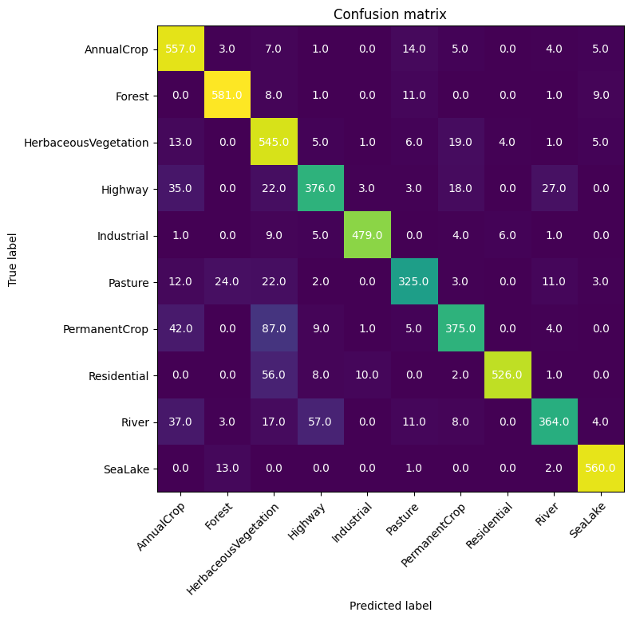
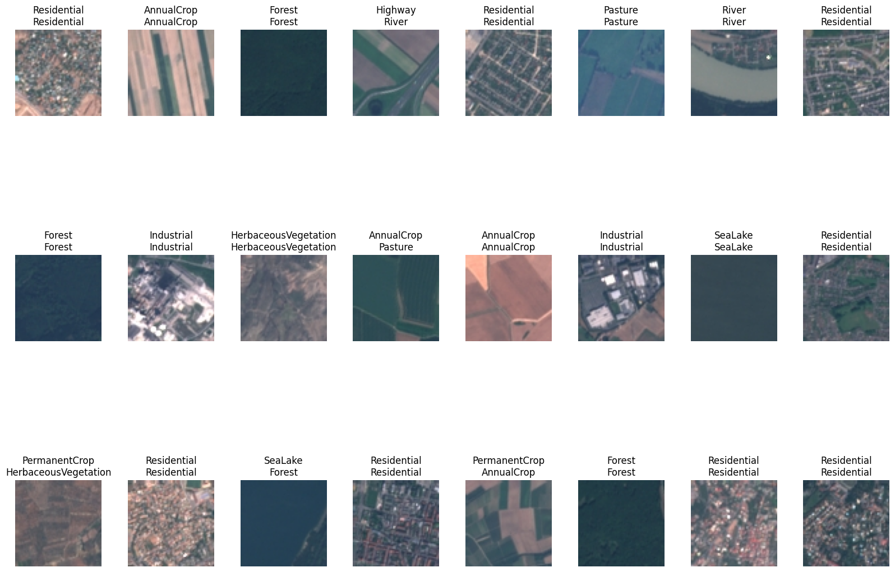
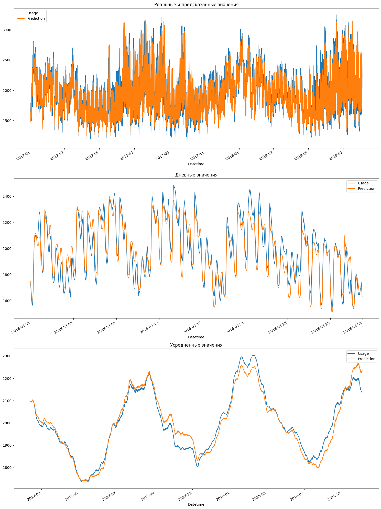

# Вузовские работы за этот семестр

В каталогах power и image-recognition должны быть распакованы архивы data.zip для работоспособности. Не стал выкладывать данные как есть, поскольку индексация тысяч мелких файлов слишком много времени.

## Image-recognition
Классификация изображений по категориям

## Power
Предсказание потребления электроэнергии в конкретный час. В соответствующей директории лежит полный отчет.

